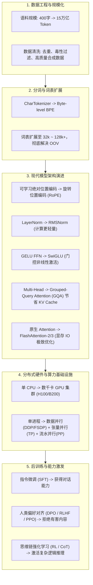

# 从玩具模型到万亿参数

当你跑通了 `base-model-lab` 并看懂了每一个矩阵乘法与损失计算后，恭喜你——你已经跨越了大模型预训练的核心技术门槛！

那么，从这个 **2.7 万参数的小模型** 走向类似 **LLaMA、DeepSeek、GPT-4** 这样工业级基座模型，中间有哪些关键的技术演进阶梯？

---

## 🗺️ 工业级演进全景路线图

---

## 🛠️ 关键升级维度剖析

### 1. 词嵌入与位置编码：转向 RoPE
- **本项目**：`nn.Embedding(block_size, width)` 绝对位置编码。缺点是无法外推到更长的上下文（超过 32 会报溢出）。
- **现代架构**：**RoPE（旋转位置编码，Rotary Position Embedding）**。通过在复数域旋转 $Q$ 和 $K$ 向量，使注意力自然建模相对距离，支持结合 YaRN 等算法将上下文窗口外推到 32k、128k 甚至 1M。

### 2. 注意力效率：FlashAttention 与 GQA
- **原生 Attention 瓶颈**：显存复杂度为 $O(N^2)$，中间注意力矩阵必须读写显存。
- **FlashAttention**：将注意力计算放在 GPU SRAM 内部切块（Tiling）融合计算，显存占用降低至线性，加速数倍。
- **GQA（分组查询注意力）**：让多个 Query 头共享一组 Key/Value 头，在几乎不损失性能的前提下，将推理阶段的 KV Cache 显存占用骤降 4~8 倍。

### 3. 分布式并行与混合精度 (bf16)
- 单机无法装下数百亿参数的权重、梯度与优化器状态（Optimizer States）。
- 业界采用 **ZeRO 技术（Zero Redundancy Optimizer）** 或 **FSDP（Fully Sharded Data Parallel）** 将模型各状态分片存放在多张 GPU 上。
- 采用 **Bfloat16 (bf16)** 或 **FP8** 格式进行混合精度训练，相比单精度 float32 提速数倍且显存减半。

---

## 🎯 循序渐进的学习建议

如果你想基于本项目继续深入实践，推荐的演进梯度如下：

1. **第一步（在现有代码上实验）**：
   - 增加 `train.py` 中的 `TinyTransformer` 层数（从 1 层堆叠到 4 层）；
   - 将中文语料扩充到几万字的短篇小说或维基百科段落；
   - 引入简单的 Train/Val 划分，在训练时同时观察验证集损失。
2. **第二步（分词器升级）**：
   - 使用 HuggingFace 的 `tokenizers` 库或者 `tiktoken` 训练一个简单的 BPE 分词器，替换 `CharTokenizer`。
3. **第三步（硬件与现代组件升级）**：
   - 迁移到 CUDA GPU（`device = 'cuda'`）；
   - 用 RMSNorm 替换 LayerNorm，手动实现 RoPE 替换绝对位置编码。
