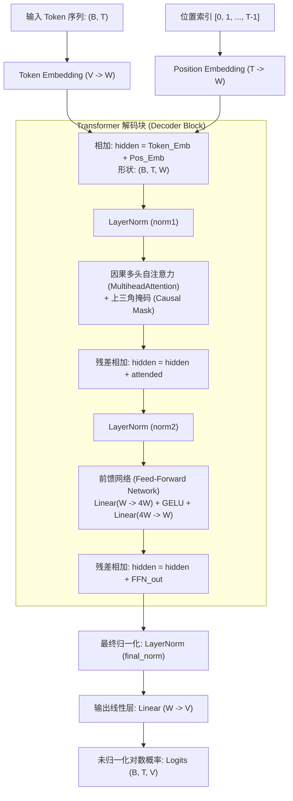

# Transformer 结构与因果自注意力

在自然语言处理史上，Transformer 架构（由 Vaswani 等人在 2017 年提出）彻底取代了循环神经网络（RNN/LSTM）。

在主流生成式大语言模型（如 GPT、LLaMA、Mistral、DeepSeek）中，通用的标准范式是 **Decoder-Only（仅解码器）自回归架构**。本项目所实现的 `TinyTransformer` 正是这个经典结构的精炼浓缩。

---

## 🏛️ 模型整体拓扑结构

下面展示了数据在 `TinyTransformer` 中的完整流动过程：



> **符号说明**：  
> - `B`: 批次大小 (Batch Size，如 8 或 16)  
> - `T`: 序列长度 (Sequence Length / Block Size，如 32)  
> - `W`: 隐藏层维度 (Hidden Width，如 32)  
> - `V`: 词表大小 (Vocab Size，本项目为 199)

---

## 🔍 核心组件详解

### 1. 词嵌入与可学习绝对位置编码
由于 Transformer 是纯矩阵并行计算，本身**不具备任何时序概念**。如果不加位置信息，“我吃苹果”与“苹果吃我”对它来说是完全等价的。

本项目采用最直观的可学习绝对位置嵌入：
```python
# train.py L23-L24 & L37
self.token_embedding = nn.Embedding(vocab_size, width)
self.position_embedding = nn.Embedding(block_size, width)

# 前向传播相加
positions = torch.arange(length, device=tokens.device)
hidden = self.token_embedding(tokens) + self.position_embedding(positions)
```

### 2. 因果注意力掩码 (Causal Attention Mask)
在做自回归生成时，模型绝对不能“穿越”看到未来的字。

例如，输入句子为 `[春, 天, 来, 了]`：
- 预测 `春` 之后是什么时，只能看 `[春]`
- 预测 `天` 之后是什么时，只能看 `[春, 天]`
- 预测 `来` 之后是什么时，只能看 `[春, 天, 来]`

在 PyTorch 中，这是通过一个**上三角布尔掩码（Upper Triangular Mask）**实现的：

```python
# train.py L38
mask = torch.triu(torch.ones(length, length, device=tokens.device, dtype=torch.bool), diagonal=1)
```

对于一个长度为 4 的序列，掩码矩阵形态如下（`True` 表示遮蔽屏蔽，不可见）：

$$
\begin{bmatrix}
0 & 1 & 1 & 1 \\
0 & 0 & 1 & 1 \\
0 & 0 & 0 & 1 \\
0 & 0 & 0 & 0
\end{bmatrix}
$$

### 3. 多头自注意力 (Multi-Head Attention)
多头注意力允许模型在不同的表示子空间中共同关注来自不同位置的信息：
$$\text{Attention}(Q, K, V) = \text{softmax}\left(\frac{QK^T}{\sqrt{d_k}} + M\right)V$$
其中 $M$ 即为上述因果掩码（被遮蔽的位置加上 $-\infty$）。在本项目中配置为 2 个注意力头（Heads=2），每个头维度为 16。

### 4. 残差连接与 LayerNorm
深层网络容易发生梯度消失与退化，残差连接（Residual Connection）$x + f(x)$ 提供了梯度的“高速通道”。
LayerNorm 对每个样本在特征维度进行归一化，稳定每一层激活值的分布。

### 5. 前馈网络 (Feed-Forward Network)
在注意力机制融合了空间与上下文信息之后，FFN 对每一个位置的向量独立进行非线性升维与降维：
$$\text{FFN}(x) = \text{GELU}(x W_1 + b_1) W_2 + b_2$$
隐藏层维度通常扩大 4 倍（即 $32 \to 128 \to 32$），激活函数选用平滑的 GELU。
