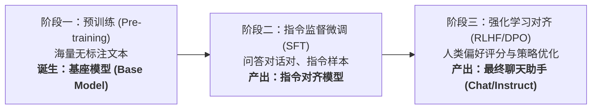

# 什么是基座模型？

在接触 ChatGPT、Claude 或 DeepSeek 时，很多人会下意识地认为“大模型生来就是一个能聊天、懂礼貌、会拒绝违规请求的助手”。

但实际上，**模型在被训练出来之初，根本不知道自己是一个“助手”**。

## 🧬 大模型的生命周期三阶段

现代通用大语言模型的构建通常经历以下三个关键阶段：

1. **预训练（Pre-training）**：使用万亿级别的无标注互联网文本，让模型学习“给定前文，预测下一个 Token”。本阶段产出的产物就是 **基座模型（Base Model / Foundation Model）**。
2. **指令监督微调（SFT, Supervised Fine-Tuning）**：用高质量的 Prompt-Response 对进行微调，教会基座模型“听懂指令、扮演助手”。
3. **强化学习对齐（RLHF / DPO）**：基于人类反馈强化学习，让模型更真实、更有帮助且不产生有害输出（Helpful, Honest, Harmless）。

---

## 🔮 基座模型的本质：“文字接龙机器”

基座模型的数学目标极其单纯：

$$\max_{\theta} \sum_{i=1}^{T} \log P(x_i \mid x_1, x_2, \dots, x_{i-1}; \theta)$$

用大白话翻译，这就是**“最强文字接龙算法”**。它代表的核心含义是：**“调整模型参数，让它对真实语料库中每一个‘下一个字’的预测概率总和最大化”**。

#### 符号通俗拆解
- **$x_1, x_2, \dots, x_T$**：输入文本里的每一个字符/Token（比如“我 喜 欢 喝 奶 茶”，序列长度 $T=6$）。
- **$x_1, \dots, x_{i-1}$（记为 $x_{<i}$）**：**已知的前文**。比如猜第 4 个字时，前文是“我 喜 欢”。
- **$P(x_i \mid x_{<i}; \theta)$**：**条件概率**。表示在已知前文和当前模型参数 $\theta$ 的条件下，模型预测出下一个字刚好是真实目标字 $x_i$（如“喝”）的概率。
- **$\log$（对数）**：因为每个词的概率是 $0 \sim 1$ 之间的小数，连续相乘极易导致浮点数下溢（精度归零）；取对数后，原本的**“概率连乘”**就变成了**“对数求和”**。
- **$\sum_{i=1}^{T}$（累加）**：把整篇文章从第 1 个字到第 $T$ 个字的所有预测得分全部加起来。
- **$\max_{\theta}$（最大化）**：通过梯度反向传播，寻找一组最优的神经网络权重 $\theta$，让模型猜中下一个字的总体似然得分最高。

> 💡 **对应代码实现**：在深度学习（如 PyTorch）中，优化器习惯做“最小化”而不是“最大化”，因此给上面的公式加上负号，就变成了工程中天天打交道的 **负对数似然损失（Negative Log-Likelihood）**，即 `nn.CrossEntropyLoss()`：
> $$\mathcal{L} = - \sum_{i=1}^{T} \log P(x_i \mid x_{<i}; \theta)$$

### 表现特征
- **纯粹的文本续写**：
  - 如果你给它输入：“中国的首都是”，它倾向于补全为“北京”。
  - 如果你给它输入：“写一首赞美春天的诗”，在预训练阶段它可能不会老实写诗，而是接着写出：“这是初中语文考试的第一道题目，满分5分……”，因为它在网上见过的文本里，这句话后面经常跟着试卷题注！
- **不具备内置的道德与对话规范**：
  - 它完全受前文概率引导。

---

## 🧪 为什么 Base Model Lab 专注于基座模型？

在工业界，预训练消耗了整个大模型研发中 **95% 以上的算力、资金与工程复杂度**。

理解了基座模型如何从随机初始化权重、通过注意力机制与因果掩码学会预测下一个字符，你就掌握了生成式 AI 最底层的数学物理规律。

在本项目中：
- 我们没有预设对话角色；
- 我们没有系统提示词（System Prompt）；
- 模型做的事情，就是从第一句“雨停了，...”开始，一步步把下一个字符的交叉熵损失压缩到最小。
